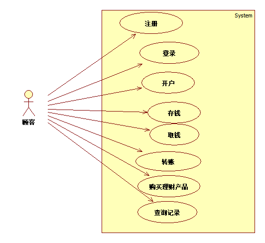
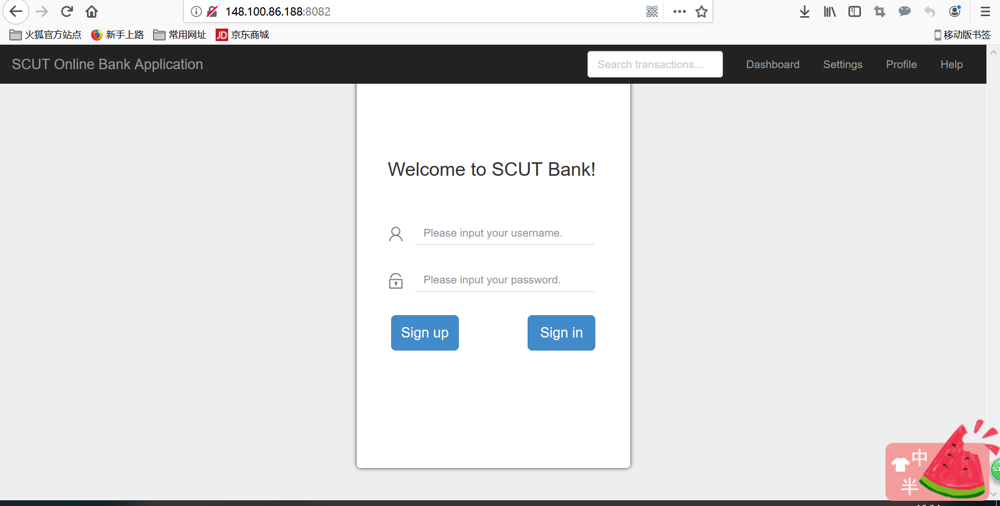
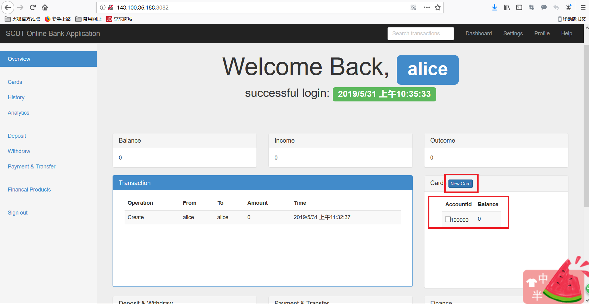
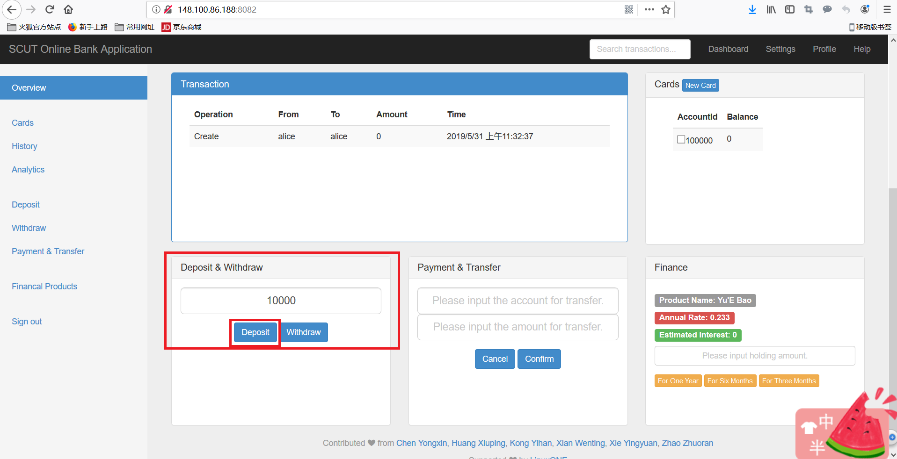
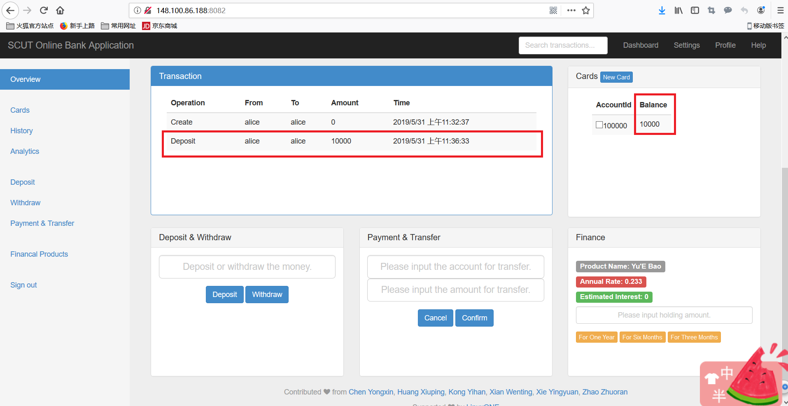
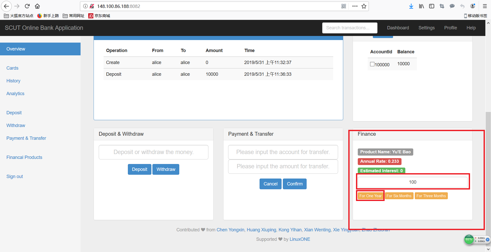
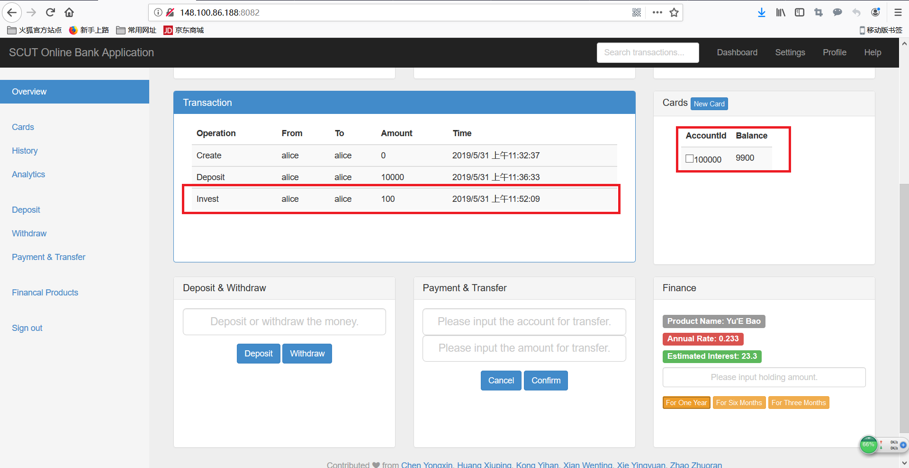
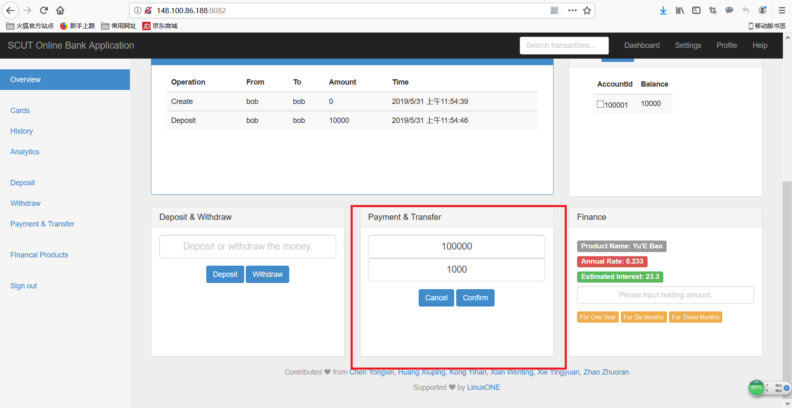
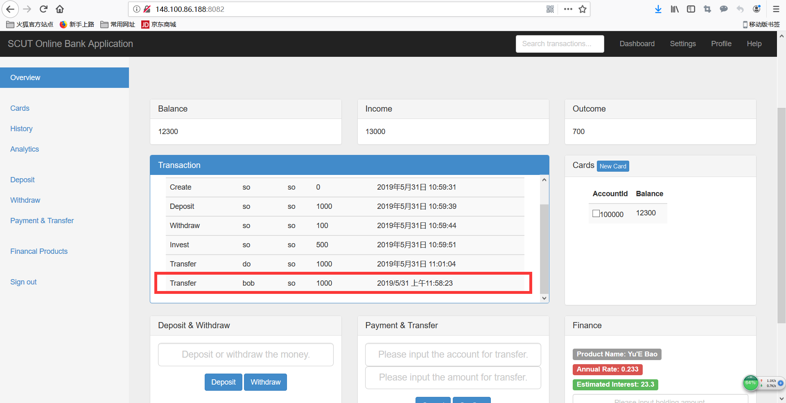
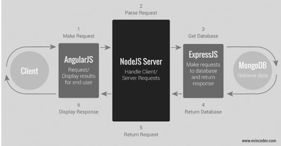

# SCUT ONLINE BANK APPLICATION

## 业务分析

### 用例图

### 功能展示

- 注册和登录
  
  
- 开卡
  

- 存款和取款
  
  

- 购买理财产品
  
  
  
- 转账

## 技术选型

### MEAN STACK框架 

- **MongoDB**：MongoDB是一个使用JSON风格存储的数据库,解决数据存储问题
- **Express.js**：ExpressJS是一个Web应用框架，提供Route切换和HTTP交互的封装服务
- **Angular.js**：是一个前端MVC框架，提供前后端和数据库交互的统一框架
- **Node.js**：是一个并发、异步、事件驱动的Javascript服务器后端开发平台，提供和服务器交互的服务
- **bootstrap**: 前端开发框架

### 架构目录

        mean-docker
        ├── docker-compose.yml
        ├── express-server
        │   ├── app
        │   │   ├── models
        │   │   │   ├── account.js
        │   │   │   ├── customer.js
        │   │   │   ├── todo.js
        │   │   │   └── transaction.js
        │   │   └── routes.js
        │   ├── config
        │   │   └── database.js
        │   ├── Dockerfile
        │   ├── license
        │   ├── package.json
        │   ├── public
        │   │   ├── backup.html
        │   │   ├── css
        │   │   │   ├── dashboard.css
        │   │   │   ├── reset.css
        │   │   │   ├── signin.css
        │   │   │   ├── style.css
        │   │   │   └── theme.css
        │   │   ├── img
        │   │   │   ├── bg.jpg
        │   │   │   ├── name.png
        │   │   │   └── password.png
        │   │   ├── index.html
        │   │   └── js
        │   │       ├── controllers
        │   │       │   └── main.js
        │   │       ├── core.js
        │   │       └── services
        │   │           ├── accounts.js
        │   │           ├── customers.js
        │   │           ├── todos.js
        │   │           └── transactions.js
        │   ├── README.md
        │   └── server.js
        ├── README.md
        └── test
